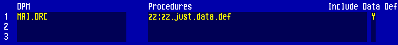

# Miscellaneous

## Programmer Utilities

```
$PRU(%)
```


## Object Code Search & Print

1. `$PRU(%)`
2. Select **3. SEARCH**
3. Search in background
4. When finished, back to front end
5. `$COPY2DOS.FLAT(%.PRU.SEARCH,"<FILE PATH>")`

Example:

```
$COPY2DOS.FLAT(%.PRU.SEARCH,"C:\search.txt")
```


## Find the address of a database and open it to the prefix of your choice

```
$FPN(^<PREFIX>)
```

To open to it:
```
O(<PREFIX>,<ADDRESS>)
```

Example:
```
OPEN ADM
$FPN(^:)
O(:,1N1013076)
```


## Rebuild ADM *AA for a PRE IN cancel

```
%ADM.PAT.zcus.dalt.rebuild.aa("AA","UNIT","EA","FAC")
```

Liverpool Womens / Countess:
```
%ADM.PAT.zcus.rebuild.aa("AA","UNIT","EA")
```

Make sure to look at the procedure logic first, so you know what’s happening


## Using the $VIEW command

`V <program>` OR `$VIEW(<program>)`

Program format: `%<DPM>.<Procedure>`

If nothing is returned:

* Check to make sure there’s no custom front end running
* Make sure object code exists for the program


## Using the FOLLOW program in MAGIC (prints procedure pathways)

1. Go to MA1:XXX.SWM
2. `%FOLLOW2(mac,job)`
    * mac is the machine, and job is the job number.

Example:
```
%FOLLOW2("MC1",1123)
```


## Server Status

```
$MCL(0)
```


## Move a DPM’s Data Definitions with a change number in MAGIC NPR

In the Procedures section:

* DPM: The DPM you’d like to move
* Procedures: zz:zz.just.data.def
* Include Data Def: Y




## Remove a change number from MAGIC NPR

1. `OPEN NPR`
2. Nil out @NPR.APPL.updates for the obsolete change number
3. Kill the child segments

Example:
```
OPEN NPR
""^&IA["ADM"]R[5.64]UPD[300.01]
K(&IA["ADM"]R[5.64]UPD[300.01])
```


## Print list of procedures for a change number

```
OPEN NPR
`<APPLICATION>,<RELEASE>,<CHANGE NUMBER>'^{ia,ir,iaU}
""^qi^LF,N(iaU)N^#,DO{+(&IA[ia]R[ir]UPD[iaU]D[qi],Y)^qi N(Y|0_._Y|1)^#,LF+1^LF,IF{LF=15 N("<Enter>")^#,#0,""^LF}}
```

Example:

```
OPEN NPR
`MRI,5.67,385.05'^{ia,ir,iaU}
""^qi^LF,N(iaU)N^#,DO{+(&IA[ia]R[ir]UPD[iaU]D[qi],Y)^qi N(Y|0_._Y|1)^#,LF+1^LF,IF{LF=15 N("<Enter>")^#,#0,""^LF}}
```


## Job off a procedure from the front end

```
%Z.bj.start(PGM_NAME,EXT_NAME,UP_TO_10_ARGS)
```
* Starts the background job. EXT_NAME is the string that will appear on the lock that is written for the procedure. You can enter anything there.

```
%Z.bj.end.job(EXT_NAME)
```
* Ends the job.

```
%Z.bj.check(EXT_NAME)
```


## Convert date/time to S(0) format

```
%Z.date.time.to.seconds(<YYYYMMDD>,<HHMM>)
```

Example:

```
%Z.date.time.to.seconds(20150330,0857) = 1106989020
```


## Open Command Return Values

Syntax: `O(prefix,structure)`

|Value|File type|
|---|---|
| 0 | Sequential Access File (SAF) |
| 1 | Random Access File (RAF) |
| 8 | Sequential Access Directory (SAD) |
| 9 | Random Access Directory (RAD) |


## Access $T Error Log from %Z.fec

```
$FE.ERR.VIEW("")
```


## Find large spool files in MIS

```
OPEN MIS
""^X^CT,500^PG,DO{+(*GXA[X],Y)^X IF{PG<Y|11 CT+1^CT,N("Spool file",X,"-",Y|11,"pages")N(" ->",IF{Y|1;"[No Title]"})^#}},NN(CT,"records with over",PG,"pages.")^#
```

Replace `500^PG` with the minimum number of spool report pages you want to count.

Sorted by number of pages:

```
OPEN MIS
K(/BIGSPOOL),""^X,500^PG,DO{+(*GXA[X],Y)^X IF{PG<Y|11 IF{Y|1;"[No Title]"}^/BIGSPOOL[Y|11,X]}}
""^X^CT,DO{<(/BIGSPOOL[X],Y)^X CT+1^CT,IF{CT\12=0 N("***Continue***")^#,#0},N("Spool file",X#1S,"-",X#0S,"pages")N(" ->",Y)^#}
```


## Firewall tests from the front end

```
%VPN.TEST("")
```


## Print to screen to prevent timeout

Add this to a loop to prevent timing out, which will write a period to the screen every ten seconds (remember to initialize S):

```
IF{S(0)>S .^#,S(0)+10^S},
```


## Read list of values (one per line) from a local file into slash

MAGIC:
```
%Z.dos.read("<FILE NAME>",^/<STRUCTURE>,"",1)
```

CS:
```cs
%Z.win.file.open("")^PATH,
O(!(FILE),PATH),
0^CT,DO{!(FILE)T^R {R#0A,R#2A}^/READ[CT+1^CT]}
```


## Convert number from one base to another

```
$RADIX(<NUMBER TO CONVERT>,<BASE OF NUMBER>,<BASE TO CONVERT TO>)
```

Example:
```
$RADIX(15,10,16) = 000F
```


## Efficient forms of OR and AND
Using the OR (!) and AND (&) operators are generally inefficient because they do not use short-circuit evaluation.

**OR:** Use a nested `IF` statement

Example: if `A` or `B` or `C`, `DO.THINGS`:

```
IF{IF{A;B;C} @DO.THINGS}
```

**NOR:** Same as OR but use *else*, or wrap OR inside a `@Not`

Example: if not (`A` or `B` or `C`), `DO.THINGS`:

```
IF{IF{A;B;C};
   @DO.THINGS}

IF{@Not(IF{A;B;C}) @DO.THINGS}
```

**AND:** Use **else** statements and test using negated statements

Example: if `A` and `B` and `C`, `DO.THINGS`:

```
IF{@Not(A);
   @Not(B);
   @Not(C);
   @DO.THINGS}
```

* Always try to order the operands from most to least likely to be true.
* Be careful when refactoring control statements within existing code--there are various "hacks" using control statements to hold specific values in variables.


## Using @Link in MAGIC
`@Link` is a macro used to open an application's prefixes in a procedure.

Usage:
```
@Link([prefix],[application],[logical file name],"[database]")
```

* Quotation marks are optional for the first three arguments

You can find the logical file name of the RAF you want to open to in the View Application routine in NPR. Database can be hardcoded or found in the main application's dictionary.

Example:
```
@Link(!,ABS,patient.file,"ABS.LVW")
```

**NOTE:** If you are linking a RAF to a different prefix than the one defined in NPR, you need to use the `@Chg.prefix` macro which tells the translator to reference the new prefix when accessing the RAF.

Usage:
```
@Chg.prefix([DPM],[defined prefix],[prefix opened in @Link])
```

Using the ABS example above: Without `@Chg.prefix`, @ABS.PAT.account.number translates to `:DZ[dz]|2`, which is likely open to another prefix at this point. Calling `@Chg.prefix` will cause all subsequent references of @ABS.PAT.account.number to translate to `!DZ[dz]|2` instead.
```
@Link(!,ABS,patient.file,"ABS.LVW")
@Chg.prefix(ABS.PAT,:,!)
```


## Physical vs Logical nexting

| Function | Operator |
|---|---|
| Physical next | > |
| Physical prev | < |
| Logical next | + |
| Logical prev | - |